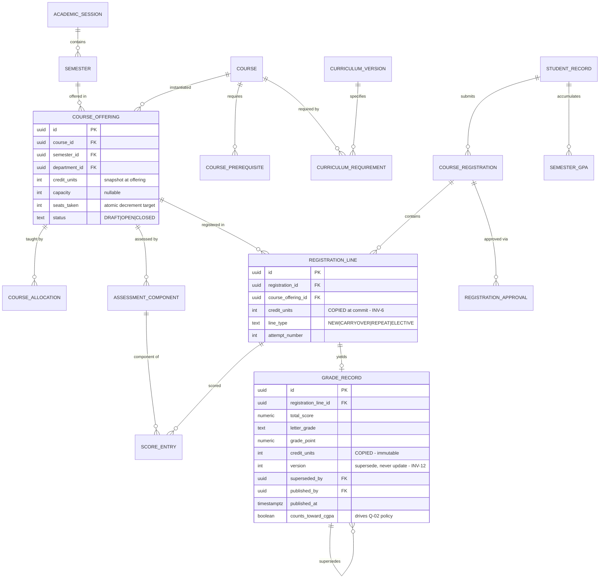
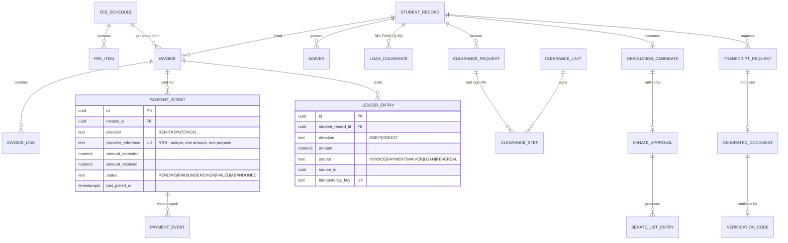

# ePortal Blueprint — Part 1: Core Architecture (§1–§7)

> Companion documents: `00-SPEC-PROVENANCE.md` (where requirements came from),
> `01-OPEN-QUESTIONS.md` (`Q-nn` flags), `03-WORKFLOWS.md` (§8–§14),
> `04-PLATFORM.md` (§15–§23), `05-ROADMAP.md` (§24 + risk register).

---

# §0 The Prime Invariant

Everything in this document is subordinate to one rule:

> **THE UNIVERSITY IS THE SOURCE OF TRUTH FOR STUDENT IDENTITY.**

This is not a UI concern, not a validation rule, and not a policy document. It is enforced
**structurally, at four independent layers**, such that violating it requires defeating all four:

| Layer | Mechanism | Defeating it requires |
|---|---|---|
| **L1 Schema** | Protected columns live in `student_record`, owned by a DB role the application cannot `UPDATE` | Compromising DB superuser credentials |
| **L2 Database** | `BEFORE UPDATE` trigger raises an exception if any protected column changes outside an approved amendment transaction | Dropping the trigger (itself audited) |
| **L3 Service** | No service method accepts protected fields from a student-scoped principal; amendments route through a separate dual-control command | Code change passing review |
| **L4 API** | Student-facing DTOs physically do not contain protected fields — they cannot be expressed in a request body | Deploying a modified API contract |

**Design consequence that follows immediately:** a student's *login account* and a student's
*academic record* are two different things with two different lifecycles and two different
owners. Conflating them — the single `users` table with a `matric_no` column that most tutorial
SIS designs use — makes the invariant unenforceable, because account self-registration then
implies record self-creation. This blueprint keeps them permanently separate (§7).

This is independently corroborated by how Nigerian admission actually works: authority flows
JAMB → CAPS → institution → student. The student is the *last* party in the chain, never the
originator (`R2`).

---

# §1 System Architecture

## 1.1 Architectural style: modular monolith

**Decision: a modular monolith with strictly enforced internal boundaries, deployed as a single
process, with asynchronous workers split out.**

Rejected alternatives and why:

| Option | Verdict | Reason |
|---|---|---|
| Microservices | **Rejected for v1** | Research exists showing microservice course-registration frameworks outperform monoliths under load (`R12`), but distributed transactions across registration ↔ finance ↔ results would dominate the build. A university's data is one tightly-coupled graph; premature decomposition buys operational cost, not scale. |
| Layered monolith (no modules) | **Rejected** | Becomes a big ball of mud; the invariant in §0 depends on module boundaries being real. |
| Serverless | **Rejected** | Cold starts against a spiky-then-idle workload, and NDPA cross-border transfer restrictions (`R15`) complicate managed-cloud choices. |

Modular monolith is chosen because **the module boundaries are the security boundaries**. Each
module owns its tables; cross-module access goes through a published interface, never a direct
foreign-key join into another module's internals. This yields microservice-ready seams without
distributed-systems cost. If registration load later justifies extraction (`R12`), the seam
already exists.

## 1.2 Reference topology

```
                          ┌─────────────────────────┐
   Students / Staff  ───▶ │  CDN + WAF + Rate limit │
                          │  (edge; static assets)  │
                          └───────────┬─────────────┘
                                      │
                          ┌───────────▼─────────────┐
                          │  Virtual Waiting Room   │  ◀── admission control,
                          │  (registration windows) │      only during peaks (R12)
                          └───────────┬─────────────┘
                                      │
                          ┌───────────▼─────────────┐
                          │   Reverse proxy / LB    │
                          └───────────┬─────────────┘
                    ┌─────────────────┼─────────────────┐
                    │                 │                 │
            ┌───────▼──────┐  ┌───────▼──────┐  ┌───────▼──────┐
            │  App node 1  │  │  App node 2  │  │  App node N  │   stateless
            │  (API + SSR) │  │              │  │              │   horizontally scaled
            └───────┬──────┘  └───────┬──────┘  └───────┬──────┘
                    └─────────────────┼─────────────────┘
                    ┌─────────────────┼──────────────────┬──────────────┐
                    │                 │                  │              │
            ┌───────▼──────┐  ┌───────▼───────┐  ┌───────▼─────┐ ┌──────▼──────┐
            │ PostgreSQL   │  │ Redis         │  │ Object      │ │ Job queue   │
            │ primary      │  │ cache/session │  │ store (S3   │ │ (BullMQ)    │
            │  + replica(s)│  │ + dist. locks │  │ compatible) │ └──────┬──────┘
            └──────────────┘  └───────────────┘  └─────────────┘        │
                    ▲                                            ┌──────▼──────┐
                    │                                            │  Workers    │
                    └────────────────────────────────────────────┤ (GPA calc,  │
                                                                 │  PDFs, mail,│
                                                                 │  reconcile) │
                                                                 └─────────────┘
```

**Read/write split:** the course catalogue and all read-heavy browsing hit replicas and cache;
the seat-claim and registration-commit paths hit the primary under transaction. This directly
implements the `R12` conclusion — *cached read path, narrowly-scoped transactionally-correct
write path*.

## 1.3 Technology stack

> **`Q-32` is a BLOCKER on this entire section.** If your course mandates a stack (PHP/Laravel +
> MySQL is common in Nigerian university projects), that overrides everything below. The
> architecture, domain model, schema, RBAC design, and workflows in this blueprint are
> **stack-independent** and survive that substitution; only this table changes.

| Concern | Choice | Rationale |
|---|---|---|
| Language | TypeScript (Node 20 LTS) | One language across API and frontend; strong typing matters when encoding academic rules |
| API framework | NestJS | First-class module system — the DI container *enforces* §1.1 boundaries rather than relying on convention |
| Database | PostgreSQL 16 | Row-level security, partial/expression indexes, advisory locks (needed for §19 hash chain), `SERIALIZABLE`/`REPEATABLE READ`, range types for academic periods, PITR |
| ORM / query | Prisma (schema + migrations) + raw SQL for hot paths | Typed models; raw SQL where the query planner matters (GPA aggregation, seat claim) |
| Cache / locks | Redis 7 | Session store, cached catalogue, distributed locks, rate-limit buckets |
| Queue | BullMQ (Redis-backed) | Retries with backoff, scheduled jobs, dead-letter queues for payment reconciliation |
| Frontend | Next.js (App Router), React, TypeScript | SSR for low-bandwidth first paint (see §16), one deployable |
| Styling | Tailwind + a small owned component library | See §16 — no heavyweight UI kit over slow networks |
| Object storage | S3-compatible (MinIO on-prem / AWS S3) | Object-lock for WORM audit anchoring (§19, §23) |
| Auth | Self-hosted; Argon2id; short-lived JWT access + rotating refresh in `httpOnly` cookie | §6 |
| PDF generation | Server-side, deterministic, in a worker | Transcripts must be byte-reproducible (§13) |
| Observability | OpenTelemetry → Prometheus/Grafana; Sentry | §22 |
| Runtime | Docker Compose (small) → Kubernetes (only if `Q-33` justifies) | Don't buy k8s complexity for 30k students |

**Deliberate omissions:** no blockchain (§13 explains why signed PDFs + a verification endpoint
solve the actual problem — the research consensus is that only issuer keys/hashes belong on-chain
anyway, `R9`); no microservices (§1.1); no GraphQL (§15); no Kafka.

## 1.4 Environments

`local` → `ci` → `staging` (production-shaped, anonymised data) → `production`.
Plus a **`drill`** environment used only for restore rehearsals (§23) — restoring a backup into
staging is not a drill, because staging's config differs from production's.

---

# §2 Domain Model

## 2.1 Bounded contexts

Eleven contexts. Each owns its tables exclusively; no cross-context foreign keys except to the
two **shared kernel** identifiers (`student_record.id`, `academic_session.id`), which are
immutable and therefore safe to reference.

```
┌────────────────────────────────────────────────────────────────────────┐
│                          SHARED KERNEL                                 │
│   StudentRecordId · AcademicSessionId · Money · GradePoint · Scope     │
└────────────────────────────────────────────────────────────────────────┘

  ┌──────────────┐   ┌──────────────┐   ┌──────────────┐   ┌──────────────┐
  │  IDENTITY    │   │ ORGANISATION │   │  ADMISSION   │   │   STUDENT    │
  │ & ACCESS     │   │ faculty/dept │   │ application  │   │   RECORDS    │
  │ users, roles │   │ programme    │   │ offer,accept │   │ MASTER (§7)  │
  │ activation   │   │ session/sem  │   │ matric issue │   │ status,level │
  └──────┬───────┘   └──────┬───────┘   └──────┬───────┘   └──────┬───────┘
         │                  │                  │                  │
         │           ┌──────▼───────┐   ┌──────▼───────┐          │
         │           │  CURRICULUM  │   │   FINANCE    │          │
         │           │ course,offer │   │ invoice,pay  │          │
         │           │ prereq,alloc │   │ ledger,waiver│          │
         │           └──────┬───────┘   └──────┬───────┘          │
         │                  │                  │                  │
         │           ┌──────▼───────┐          │                  │
         │           │ REGISTRATION │◀─────────┘ (fee gate)       │
         │           │ reg,lines    │                             │
         │           │ approvals    │                             │
         │           └──────┬───────┘                             │
         │                  │                                     │
         │           ┌──────▼───────┐   ┌──────────────┐          │
         │           │  ASSESSMENT  │──▶│ EXAMINATION  │          │
         │           │ scores,grades│   │ timetable    │          │
         │           │ approval,GPA │   │ card,seating │          │
         │           └──────┬───────┘   └──────────────┘          │
         │                  │                                     │
         │           ┌──────▼─────────────────────────┐           │
         │           │  GRADUATION & CLEARANCE        │◀──────────┘
         │           │  clearance, senate list        │
         │           └──────┬─────────────────────────┘
         │                  │
         │           ┌──────▼───────┐
         │           │  CREDENTIALS │  transcripts, certificates, verification
         │           └──────────────┘
         │
  ┌──────▼─────────────────────────────────────────────────────────────┐
  │  CROSS-CUTTING: Audit (§19) · Notification (§18) · Documents (§17)  │
  └─────────────────────────────────────────────────────────────────────┘
```

## 2.2 Aggregates and invariants

Listing only the invariants that matter — the ones a reviewer should check the implementation
against later.

### Identity & Access
- `User` — a login principal. **Has no academic meaning.**
- `RoleAssignment` — `(user, role, scope)`. Scope is a tuple, never baked into the role name (`R10`).
- `ActivationToken` — single-use, expiring, bound to exactly one `student_record`.
- **INV-1:** A `User` may be linked to **at most one** `student_record`, and that link is
  set exactly once, by the activation ceremony (§6.4). It is never re-pointed. Unlinking
  requires a Registrar-level amendment with audit.

### Student Records (§7 in full)
- `StudentRecord` — the master academic record. Created **only** by import or admission conversion.
- **INV-2:** `matriculation_number` is globally unique, **system-generated**, and immutable
  once issued.
- **INV-3:** No protected field is writable by any student-scoped principal, ever (§0).
- **INV-4:** `academic_status` transitions only via the state machine in §7.5, never by direct assignment.
- **INV-5:** A `StudentRecord` may exist with **no linked `User`** — this is the normal state
  between import and activation, and it is what makes the invariant enforceable.

### Curriculum
- `Course` is a catalogue entity; `CourseOffering` is `Course × Session × Semester × Department`.
- **INV-6:** Registration references a `CourseOffering`, never a `Course`. Credit units are
  copied onto the registration line at commit time, so a later catalogue edit cannot
  retroactively alter a historical GPA.
- `CurriculumVersion` — programme requirements are **versioned by admission cohort**.
- **INV-7:** A student is assessed against the curriculum version of their admission session,
  not the current one. Without this, a curriculum change silently invalidates existing students'
  graduation eligibility.

### Registration
- `CourseRegistration` (header, per student per session-semester) + `CourseRegistrationLine`.
- **INV-8:** Total units on a registration must satisfy min/max at commit (`Q-03`).
- **INV-9:** Once `LOCKED`, lines are immutable; changes require a formal add/drop with approval.
- **INV-10:** No exam eligibility without a locked registration line for that offering
  (this is the `R4` rule: unregistered ⇒ cannot sit).

### Assessment
- `ScoreEntry` per student per assessment component; `GradeRecord` is the derived, published outcome.
- **INV-11:** Component weightings are set by the HOD at allocation, **not by the lecturer** (`R11`).
- **INV-12:** A `GradeRecord` is immutable after publication. Corrections create a *superseding
  version*; nothing is ever updated in place (§10.6).
- **INV-13:** GPA/CGPA are **derived values**, never user-writable, and always recomputable
  from `GradeRecord` history. Stored as materialised snapshots for performance, with the
  recomputation being the source of truth.

### Finance
- **INV-14:** Money movements are append-only ledger entries. Balances are derived, never updated in place.
- **INV-15:** Every gateway interaction is idempotent on a provider reference (RRR / gateway ref).
- **INV-16:** Fee clearance is a *state derived from the ledger plus waivers plus approved loans*
  (`Q-39`), not a boolean flag someone sets.

### Graduation
- **INV-17:** A `GraduationCandidate` cannot reach `SENATE_APPROVED` with any outstanding
  curriculum requirement or any unfinished clearance step (`R6`).
- **INV-18:** The graduation date on a Statement of Result **must equal** the Senate approval
  date on the Senate List — enforced by deriving both from one field, never storing twice.
  (`R6` records that mismatches get students sent home from NYSC camp; this is a data-integrity
  requirement, not cosmetic.)

## 2.3 Ubiquitous language

| Term | Meaning here | Not to be confused with |
|---|---|---|
| **Student Record** | University-owned master academic record | User account |
| **User** | Login principal | Student |
| **Activation** | Binding a User to a pre-existing Student Record | Registration |
| **Registration** | Enrolling in courses for a semester | Account signup |
| **Session** | Academic year (e.g. 2025/2026) | Login session — always call that "auth session" |
| **Level** | 100L…600L standing | Year of study (differs after repeats) |
| **Result** | Published grade outcome | Score (raw mark) |
| **Carryover** | Failed course to be retaken | Outstanding fee |
| **Spill-over** | Final-year student with outstanding courses (`R5`) | Deferment |
| **Graduation List** | All graduates by department/batch | **Senate List** — per-graduate NYSC record (`R6`) |
| **Clearance** | Multi-unit sign-off before graduation | Fee clearance for registration |

The Graduation List / Senate List distinction is a genuine source of confusion and has real
consequences — a student on one but not the other cannot mobilise for NYSC (`R6`).

---

# §3 Database Schema and ERD

PostgreSQL. All tables carry `id uuid pk default gen_random_uuid()`, `created_at`, `updated_at`,
and — where mutable — `updated_by uuid references users(id)`. Soft delete via `deleted_at` only
where genuinely needed; **academic records are never deleted**.

## 3.1 ERD — identity and student master (the critical region)

```mermaid
erDiagram
    USER ||--o{ ROLE_ASSIGNMENT : has
    ROLE ||--o{ ROLE_ASSIGNMENT : grants
    ROLE ||--o{ ROLE_PERMISSION : contains
    PERMISSION ||--o{ ROLE_PERMISSION : in
    USER ||--o| STUDENT_RECORD : "activates (0..1, once)"
    USER ||--o{ AUTH_SESSION : owns
    USER ||--o{ MFA_FACTOR : enrols

    STUDENT_RECORD ||--o{ ACTIVATION_TOKEN : "unlocked by"
    STUDENT_RECORD ||--|| PROGRAMME : "enrolled in"
    STUDENT_RECORD ||--o{ STUDENT_STATUS_HISTORY : "status over time"
    STUDENT_RECORD ||--o| STUDENT_PROFILE : "self-editable data"
    STUDENT_RECORD ||--o{ RECORD_AMENDMENT : "changed only via"
    STUDENT_RECORD ||--o{ STUDENT_LEVEL_HISTORY : "progresses"

    FACULTY ||--o{ DEPARTMENT : contains
    DEPARTMENT ||--o{ PROGRAMME : offers
    PROGRAMME ||--o{ CURRICULUM_VERSION : "versioned by cohort"

    USER {
        uuid id PK
        citext email UK
        text password_hash "argon2id"
        text status "PENDING|ACTIVE|LOCKED|DISABLED"
        uuid student_record_id FK "NULL until activation; set once"
        timestamptz password_changed_at
        int failed_login_count
    }

    STUDENT_RECORD {
        uuid id PK
        citext matriculation_number UK "PROTECTED, system-generated"
        text jamb_registration_number UK "PROTECTED"
        text surname "PROTECTED"
        text first_name "PROTECTED"
        date date_of_birth "PROTECTED"
        uuid programme_id FK "PROTECTED"
        uuid admission_session_id FK "PROTECTED"
        text entry_mode "PROTECTED: UTME|DE|JUPEB|TRANSFER"
        int current_level "PROTECTED, derived"
        text academic_status "PROTECTED, state machine"
        uuid curriculum_version_id FK "PROTECTED, pinned at admission"
        uuid created_by FK "admin or admission job - NEVER a student"
        text origin "IMPORT|ADMISSION|MIGRATION"
    }

    STUDENT_PROFILE {
        uuid student_record_id PK_FK
        text phone "student-editable"
        text contact_address "student-editable"
        text next_of_kin_name "student-editable"
        uuid photo_file_id FK "student-uploaded, ADMIN-APPROVED"
        text photo_status "PENDING|APPROVED|REJECTED"
    }

    ACTIVATION_TOKEN {
        uuid id PK
        uuid student_record_id FK
        text token_hash "never store plaintext"
        timestamptz expires_at
        timestamptz consumed_at
        int attempt_count
    }

    RECORD_AMENDMENT {
        uuid id PK
        uuid student_record_id FK
        text field_name
        text old_value
        text new_value
        uuid requested_by FK
        uuid approved_by FK "must differ from requested_by"
        text evidence_file_id
        text status "PENDING|APPROVED|REJECTED"
    }
```

**Read the `USER` / `STUDENT_RECORD` split carefully — it is the whole invariant.** Note
`STUDENT_PROFILE` as the *only* place a student writes anything about themselves, and note that
even the passport photo requires admin approval (`Q-20` asks whether biometric capture replaces this).

## 3.2 ERD — academic core



`GRADE_RECORD.counts_toward_cgpa` is the single field that makes `Q-02` (dilution vs best-grade)
a **configuration decision rather than a rewrite**. Under dilution every attempt is `true`; under
best-grade only the highest attempt is `true`. Both policies are expressible; neither is hard-coded.

## 3.3 ERD — finance, clearance, credentials



`PAYMENT_INTENT.status` carries `UNDER` and `OVER` as **first-class states**, because `R8`
records that amount mismatches stall real Remita transactions, and `ABANDONED` because a
generated-but-unpaid RRR sits Pending indefinitely. These are not edge cases; they are the
common failure modes.

## 3.4 Enforcing the invariant at the database layer

```sql
-- L1: the application's DB role cannot write protected columns.
REVOKE UPDATE ON student_record FROM eportal_app;
GRANT  UPDATE (updated_at) ON student_record TO eportal_app;

-- L2: protected columns change only inside an approved amendment transaction,
-- signalled by a transaction-local GUC that only the amendment service sets.
CREATE OR REPLACE FUNCTION guard_student_record()
RETURNS TRIGGER LANGUAGE plpgsql AS $$
BEGIN
  IF current_setting('eportal.amendment_id', true) IS NULL THEN
    IF (NEW.matriculation_number,  NEW.jamb_registration_number, NEW.surname,
        NEW.first_name, NEW.date_of_birth, NEW.programme_id,
        NEW.admission_session_id, NEW.entry_mode, NEW.current_level,
        NEW.academic_status, NEW.curriculum_version_id)
       IS DISTINCT FROM
       (OLD.matriculation_number, OLD.jamb_registration_number, OLD.surname,
        OLD.first_name, OLD.date_of_birth, OLD.programme_id,
        OLD.admission_session_id, OLD.entry_mode, OLD.current_level,
        OLD.academic_status, OLD.curriculum_version_id)
    THEN
      RAISE EXCEPTION
        'Protected student identity field modified outside an approved amendment (INV-3)';
    END IF;
  END IF;
  RETURN NEW;
END $$;

CREATE TRIGGER trg_guard_student_record
  BEFORE UPDATE ON student_record
  FOR EACH ROW EXECUTE FUNCTION guard_student_record();
```

Plus **row-level security** so a student principal can only ever see their own row:

```sql
ALTER TABLE student_record ENABLE ROW LEVEL SECURITY;
CREATE POLICY student_self_read ON student_record FOR SELECT
  USING (
    current_setting('eportal.actor_scope', true) = 'STAFF'
    OR id::text = current_setting('eportal.actor_student_id', true)
  );
```

RLS is defence-in-depth, not the primary control — a missing `WHERE` clause in one query then
leaks nothing.

## 3.5 Indexing and partitioning

- `student_record`: unique on `matriculation_number`, `jamb_registration_number`;
  composite on `(programme_id, current_level, academic_status)` for departmental lists
- `registration_line`: composite on `(course_offering_id)` and `(registration_id)`;
  **unique partial** on `(registration_id, course_offering_id)` — a student cannot register
  the same offering twice
- `grade_record`: partial index `WHERE superseded_by IS NULL` — the "current grades" query is
  the hottest read in the system
- `audit_event`: partitioned by month, `BRIN` on `occurred_at`
- `ledger_entry`: unique on `idempotency_key`; composite `(student_record_id, created_at)`

Partition `audit_event` and `notification_dispatch` by range on time from day one — retrofitting
partitioning onto a large table in production is painful.

---

# §4 Module Boundaries

## 4.1 Dependency rule

Modules form a **directed acyclic graph**. A module may depend only on modules below it.
Cycles are a build failure, not a code-review comment — enforced by an import-boundary lint rule
in CI (§21).

```
Tier 4  credentials · graduation
             ↓
Tier 3  assessment · examination · clearance
             ↓
Tier 2  registration · finance
             ↓
Tier 1  student-records · curriculum · admission
             ↓
Tier 0  identity · organisation · [audit · notification · storage: callable by all]
```

`student-records` sits at Tier 1 and depends on nothing above it. **Nothing may write to it
except through its published amendment interface** — that is what makes §0 hold as the codebase grows.

## 4.2 Module contracts

| Module | Owns (tables) | Publishes | Must not |
|---|---|---|---|
| `identity` | users, roles, permissions, role_assignments, auth_sessions, mfa_factors, activation_tokens | `authenticate()`, `authorise(actor, permission, scope)`, `activateStudentAccount()` | Know what a matric number means |
| `organisation` | faculties, departments, programmes, academic_sessions, semesters | `resolveScope()`, `currentSession()` | Depend on students |
| `student-records` | student_record, student_profile, status/level history, record_amendments | `getRecord()`, `requestAmendment()`, `approveAmendment()`, `importBatch()` | Expose a generic `update()` **ever** |
| `admission` | applications, offers, acceptances, matric_sequences | `convertOfferToStudentRecord()` | Write `student_record` directly — must call the published creator |
| `curriculum` | courses, offerings, prerequisites, curriculum_versions, allocations | `getOfferings()`, `checkPrerequisites()`, `requirementsFor(cohort)` | Know registration state |
| `registration` | registrations, lines, approvals, periods | `openWindow()`, `submit()`, `approve()`, `lock()` | Compute grades |
| `finance` | fee schedules, invoices, payment intents, ledger, waivers, loan clearances | `isFeeCleared(student, session)`, `raiseInvoice()`, `recordPayment()` | Gate registration itself — it *answers*, registration *decides* |
| `assessment` | components, score entries, grade records, approvals, GPA snapshots | `submitScores()`, `advanceApproval()`, `publish()`, `computeCGPA()` | Be writable post-publication |
| `examination` | exam periods, timetables, venues, eligibility, attendance, misconduct | `issueExamCard()`, `checkEligibility()` | Alter results (raises an assessment amendment instead) |
| `clearance` | clearance units, requests, steps | `initiate()`, `signOff()`, `isFullyCleared()` | Approve itself |
| `graduation` | candidates, senate approvals, senate list entries | `evaluateCandidate()`, `recordSenateApproval()`, `exportSenateList()` | Bypass clearance or outstanding requirements |
| `credentials` | transcript requests, generated documents, verification codes | `requestTranscript()`, `issue()`, `verify(code)` | Recompute grades — reads published records only |

The `finance` ↔ `registration` boundary is deliberate: finance **answers** "is this student
cleared?"; registration **decides** what to do about it. Inverting this scatters academic policy
into the finance module.

## 4.3 Cross-module communication

- **Synchronous** — direct interface call within the process for queries and same-transaction commands
- **Asynchronous** — domain events on the queue for side effects, never for correctness

```
ResultPublished        → recompute GPA/CGPA, notify student, re-evaluate progression, re-evaluate graduation
PaymentConfirmed       → post ledger, re-evaluate fee clearance, notify, unlock registration eligibility
RegistrationLocked     → create exam eligibility, snapshot units, notify course adviser
StudentRecordActivated → provision student role, send welcome, audit
SenateApprovalRecorded → freeze records, generate statements, build Senate List, notify
ClearanceStepSigned    → re-evaluate overall clearance, notify next unit
```

**Rule:** a domain event never carries authority. Consumers re-check permissions and current
state; they never trust the event payload as authorisation.

---

# §5 RBAC Roles and Permission Matrix

## 5.1 Model: hybrid RBAC + ABAC

Per `R10`, scope is **never** encoded in role names — that causes role explosion. Instead:

```
Permission   = verb on a resource            e.g. result:publish
RoleAssignment = (user, role, scope)          e.g. (adebayo, HOD, dept:CPE)
Scope        = GLOBAL | FACULTY:x | DEPARTMENT:x | PROGRAMME:x | COURSE_OFFERING:x | SELF

Access granted  ⟺  role holds the permission
                AND assignment scope ⊇ the target object's scope
                AND any additional ABAC conditions hold (window open, session current, …)
```

One `HOD` role serves every department. A user may hold several assignments (a lecturer who is
also an exam officer). Scopes are hierarchical: `FACULTY:ENG ⊇ DEPARTMENT:CPE`.

## 5.2 Roles

| Role | Typical scope | Purpose |
|---|---|---|
| `SUPER_ADMIN` | GLOBAL | Break-glass. MFA-mandatory, time-boxed, every action audited. Not a daily-driver account. |
| `SYSTEM_ADMIN` | GLOBAL | Config, integrations, user administration. **No academic-record write.** |
| `REGISTRAR` | GLOBAL | Custodian of student records; approves amendments; academic calendar |
| `ADMISSIONS_OFFICER` | GLOBAL/FACULTY | Applications, offers, converting offers to records |
| `FACULTY_OFFICER` | FACULTY | Faculty-level records and result collation |
| `DEAN` | FACULTY | Faculty board approvals |
| `HOD` | DEPARTMENT | Course allocation, assessment weightings (`R11`), departmental approvals |
| `EXAM_OFFICER` | DEPARTMENT/FACULTY | Timetables, exam cards, attendance, misconduct entry |
| `LECTURER` | COURSE_OFFERING | Score entry for allocated offerings **only** |
| `COURSE_ADVISER` | PROGRAMME+LEVEL | Registration advising and first-line approval |
| `BURSAR` | GLOBAL | Fee schedules, waivers, reconciliation oversight |
| `FINANCE_OFFICER` | GLOBAL | Payment processing, invoice management |
| `LIBRARY_OFFICER` | GLOBAL | Library clearance |
| `STUDENT_AFFAIRS` | GLOBAL | Student affairs clearance, disciplinary records |
| `HEALTH_OFFICER` | GLOBAL | Medical clearance; validates medical exemptions (`R4`) |
| `SENATE_SECRETARY` | GLOBAL | Records Senate approvals (does **not** grant them) |
| `AUDITOR` | GLOBAL | **Read-only across everything**, including audit log. No writes at all. |
| `STUDENT` | SELF | Own record, registration, results, payments |
| `ALUMNUS` | SELF | Post-graduation: transcripts, verification (`Q-40`) |
| `GUARDIAN` | SELF:ward | Read-only ward view — **disabled by default**, requires student consent (`Q-38`) |
| `VERIFIER` | — | Unauthenticated/API third party: verify a credential code only |

## 5.3 Permission matrix (abridged — the security-critical rows)

`✓` allowed within scope · `✗` denied · `A` requires second approver · `R` read-only

| Permission | STUDENT | LECTURER | COURSE_ADVISER | HOD | DEAN | EXAM_OFF | REGISTRAR | BURSAR | SUPER_ADMIN | AUDITOR |
|---|---|---|---|---|---|---|---|---|---|---|
| `student_record:create` | ✗ | ✗ | ✗ | ✗ | ✗ | ✗ | ✓ | ✗ | ✓ | ✗ |
| `student_record:read` | R self | R taught | R advisees | R dept | R faculty | R dept | ✓ | R | ✓ | R |
| **`student_record:amend_protected`** | **✗** | **✗** | **✗** | **✗** | **✗** | **✗** | **A** | **✗** | **A** | **✗** |
| `student_profile:update` | ✓ self | ✗ | ✗ | ✗ | ✗ | ✗ | ✓ | ✗ | ✓ | ✗ |
| `matric_number:issue` | ✗ | ✗ | ✗ | ✗ | ✗ | ✗ | ✓ | ✗ | ✓ | ✗ |
| `activation:initiate` | ✓ self | ✗ | ✗ | ✗ | ✗ | ✗ | ✓ | ✗ | ✓ | ✗ |
| `registration:submit` | ✓ self | ✗ | ✗ | ✗ | ✗ | ✗ | ✓ | ✗ | ✓ | ✗ |
| `registration:approve` | ✗ | ✗ | ✓ | ✓ | ✓ | ✗ | ✓ | ✗ | ✓ | ✗ |
| `registration:override_limits` | ✗ | ✗ | ✗ | A | A | ✗ | A | ✗ | A | ✗ |
| `score:enter` | ✗ | ✓ own offering | ✗ | ✗ | ✗ | ✗ | ✗ | ✗ | ✗ | ✗ |
| `assessment:set_weighting` | ✗ | ✗ | ✗ | ✓ | ✓ | ✗ | ✗ | ✗ | ✓ | ✗ |
| `result:approve_dept` | ✗ | ✗ | ✗ | ✓ | ✗ | ✗ | ✗ | ✗ | ✗ | ✗ |
| `result:approve_faculty` | ✗ | ✗ | ✗ | ✗ | ✓ | ✗ | ✗ | ✗ | ✗ | ✗ |
| `result:publish` | ✗ | ✗ | ✗ | ✗ | ✗ | ✗ | A | ✗ | A | ✗ |
| `result:amend_published` | ✗ | ✗ | ✗ | ✗ | ✗ | ✗ | A | ✗ | A | ✗ |
| `gpa:recompute` | ✗ | ✗ | ✗ | ✗ | ✗ | ✗ | ✓ | ✗ | ✓ | ✗ |
| `fee:waive` | ✗ | ✗ | ✗ | ✗ | ✗ | ✗ | ✗ | A | A | ✗ |
| `payment:reverse` | ✗ | ✗ | ✗ | ✗ | ✗ | ✗ | ✗ | A | A | ✗ |
| `exam_card:issue` | ✗ | ✗ | ✗ | ✗ | ✗ | ✓ | ✓ | ✗ | ✓ | ✗ |
| `clearance:sign_off` | ✗ | ✗ | ✗ | ✓ dept | ✓ faculty | ✗ | ✓ | ✓ bursary | ✓ | ✗ |
| `senate_approval:record` | ✗ | ✗ | ✗ | ✗ | ✗ | ✗ | A | ✗ | A | ✗ |
| `transcript:issue` | ✗ | ✗ | ✗ | ✗ | ✗ | ✗ | ✓ | ✗ | ✓ | ✗ |
| `audit:read` | ✗ | ✗ | ✗ | ✗ | ✗ | ✗ | R | ✗ | R | ✓ |
| `audit:write` | ✗ | ✗ | ✗ | ✗ | ✗ | ✗ | ✗ | ✗ | ✗ | ✗ |

**The `STUDENT` column contains no `✓` against any protected field.** That is the invariant,
expressed as a matrix.

Also note `audit:write` is denied to **every** role including `SUPER_ADMIN` — audit rows are
written by the system only (§19).

## 5.4 Separation of duties

`R10` names grade-submission-vs-approval as the canonical SOD case. Enforced pairs:

| Cannot be the same person | Why |
|---|---|
| Score enterer ↔ departmental approver | A lecturer cannot self-approve their own submission |
| Amendment requester ↔ amendment approver | DB-level `CHECK (requested_by <> approved_by)` |
| Payment recorder ↔ payment reverser | Fraud control |
| Clearance signer ↔ graduation approver | Independence of the final gate |
| Any approver at stage *n* ↔ approver at stage *n+1* | No single actor walks a result up the chain |

Where an institution is small enough that one person genuinely holds two roles, the system
**blocks and requires an explicit, audited override by the Registrar** — it does not silently allow it.

## 5.5 Anti-patterns explicitly forbidden

1. Scope in role names (`cpe_dept_lecturer`) — role explosion (`R10`)
2. A boolean `is_admin` column — all authority flows through role assignments
3. Client-supplied role/scope in a token payload trusted without server-side revalidation
4. Permission checks in controllers only — enforcement belongs in the service layer with
   controllers as a second line
5. Wildcard permissions (`result:*`) — every verb is enumerated

---

# §6 Authentication and Account-Activation Architecture

## 6.1 The core distinction

```
REGISTRATION (self-service signup)  ✗  DOES NOT EXIST FOR STUDENTS
ACTIVATION   (claim a pre-existing record)  ✓  THE ONLY PATH
```

There is **no student signup endpoint**. It is not hidden, disabled, or permission-gated —
it is absent from the API surface. A student who has no `student_record` created by the
university cannot obtain a student account by any sequence of requests.

## 6.2 Principal types

| Principal | Created by | Can self-register? |
|---|---|---|
| Applicant | Self (pre-admission) | **Yes** — but an `applicant` is *not* a student and holds no `student_record` |
| Student | Activation against an existing record | **No** |
| Staff | HR/admin provisioning, or SSO/LDAP if available (`Q-20`) | No |
| Alumnus | Automatic conversion at graduation | No |
| Guardian | Invitation by a consenting student (`Q-38`) | No |
| Verifier | Anonymous, code-scoped | N/A |

The `Applicant` type resolves what would otherwise be a direct contradiction: JAMB-driven
admission *requires* prospective students to self-onboard before any university record exists
(`R2`). We allow that in a **separate identity namespace** which can never mint a `student_record`.
Conversion happens only when an authorised Admissions Officer accepts the offer (§8).

## 6.3 Authentication mechanics

- **Password hashing:** Argon2id (memory ≥ 64 MiB, time ≥ 3, parallelism 1–4). Never MD5/SHA-1/unsalted.
- **Tokens:** short-lived JWT access (10–15 min) + opaque rotating refresh token in a
  `Secure; HttpOnly; SameSite=Strict` cookie. Refresh rotation with reuse detection — a replayed
  refresh token revokes the whole family.
- **Server-side session registry** in Redis so revocation is immediate; a stateless-only JWT
  cannot be revoked, which is unacceptable when a compromised Registrar account can alter results.
- **MFA:** TOTP **mandatory** for every role that can approve, publish, waive, amend, or issue
  (Registrar, Bursar, HOD, Dean, Exam Officer, Super Admin). Optional but encouraged for students.
- **Lockout:** exponential backoff per account **and** per IP; CAPTCHA after N failures.
  Never reveal whether an identifier exists.
- **Password policy:** length-first (min 12), blocklist of breached passwords, no forced rotation
  absent evidence of compromise.
- **Break-glass:** `SUPER_ADMIN` sessions are time-boxed, require MFA, and emit a high-priority
  alert to a separate channel on every login.

## 6.4 The activation ceremony

This is the single most security-sensitive flow in the system — it is where an anonymous
internet user becomes bound to a university-owned academic identity.

```
┌──────────────────────────────────────────────────────────────────────────┐
│ PRECONDITION: student_record EXISTS, created by admin import or          │
│               admission conversion. user.student_record_id IS NULL.      │
└──────────────────────────────────────────────────────────────────────────┘

  Step 1  IDENTIFY
          Student supplies: matriculation number + JAMB registration number
                          + date of birth                              (Q-20)
          ─ Rate-limited hard (per IP, per matric, global)
          ─ Response is CONSTANT-TIME and IDENTICAL whether or not the
            record exists → prevents enumeration of the student body
          ─ No record data is echoed back at this step

  Step 2  CHALLENGE
          Out-of-band token to the contact on file (email/SMS), OR an
          admin-issued activation code handed over at physical verification.
          ─ Token: single-use, hashed at rest, 15-min TTL, max 5 attempts
          ─ Contact on file is the ADMISSION-TIME contact, never one the
            claimant supplies during this flow  ← critical; otherwise the
            attacker simply nominates their own address

  Step 3  VERIFY  (institution-configurable strength, Q-20)
          Tier A  knowledge only ....... matric + JAMB no + DOB
          Tier B  + out-of-band token .. RECOMMENDED MINIMUM
          Tier C  + document upload .... admission letter, reviewed by staff
          Tier D  + physical/biometric . in-person at Registry (R14)
          ─ R14 shows biometric accuracy of 89–95%, so a manual fallback
            path is MANDATORY at Tier D — never biometric-only

  Step 4  BIND
          ── single transaction ──────────────────────────────────────────
            • create user (or attach to a verified existing one)
            • SET user.student_record_id = <record>   ← ONCE, EVER
            • consume activation token
            • grant STUDENT role, scope SELF
            • write audit event (identity-mutation class → hash-chained)
          ────────────────────────────────────────────────────────────────
          ─ Uniqueness enforced by DB constraint, not application logic:
              ALTER TABLE users ADD CONSTRAINT uq_user_student_record
                UNIQUE (student_record_id);
          ─ Concurrent activation attempts on one record: exactly one wins

  Step 5  SECURE
          Set password (Argon2id) · offer MFA enrolment · notify all
          contacts on file that activation occurred ("was this you?")
```

**Threat model for this ceremony:**

| Threat | Control |
|---|---|
| Enumerate valid matric numbers | Constant-time identical responses; strict rate limits; no data echoed at Step 1 |
| Activate another student's record | Out-of-band challenge to the **admission-time** contact, not claimant-supplied |
| Brute-force the activation token | Hashed, single-use, 15-min TTL, 5-attempt cap, then invalidate + alert |
| Race two activations | DB unique constraint on `student_record_id`; transactional bind |
| Insider mints a fake record | Record creation is `REGISTRAR`-only, hash-chain audited, batch imports require dual approval (§7.3) |
| Re-point an activated record | No code path exists; requires a dual-control amendment |
| Stolen admission-time email | Tier C/D escalation for high-value records; re-activation always alerts all contacts |

## 6.5 Recovery

Password reset uses the **same contact-on-file discipline**. A student who has lost access to
their admission-time contact **cannot self-recover** — they must present at the Registry for
identity verification and an admin-issued token. This is deliberate friction: a self-service
recovery path that accepts a new contact address is a complete bypass of §6.4, and would make
the entire invariant theatre.

---

# §7 Student Master-Record Architecture

## 7.1 Field classification

Every field on a student is assigned to exactly one class. This table is the contract.

### Class P — PROTECTED (university-owned, student can never write)
`matriculation_number` · `student_id` · `jamb_registration_number` · `surname` · `first_name` ·
`middle_name` · `date_of_birth` · `sex` · `state_of_origin` · `lga` · `nationality` ·
`programme_id` · `department_id` (derived) · `faculty_id` (derived) · `admission_session_id` ·
`entry_mode` · `study_mode` · `curriculum_version_id` · `current_level` · `academic_status` ·
`expected_graduation_session` · `cgpa` · `graduation_status` · `degree_classification`

Mutable **only** via `RECORD_AMENDMENT` with dual control, or by the system's own derivation
(level, CGPA, status) — never by direct human assignment.

### Class D — DERIVED (system-computed, no human writes at all)
`current_level` · `cgpa` · `total_units_earned` · `academic_status` · `graduation_status` ·
`degree_classification` · `outstanding_requirements`

Recomputable from source records at any time. Stored as materialised snapshots for performance;
**a recompute that disagrees with the stored value is a P1 incident**, and a nightly
reconciliation job checks exactly this (§10.5).

### Class S — STUDENT-EDITABLE (in `student_profile`, never in `student_record`)
`phone` · `email_personal` · `contact_address` · `next_of_kin_*` · `emergency_contact` ·
`disability_accommodation_request` · `passport_photo` *(upload only; requires staff approval)*

### Class A — ADMIN-EDITABLE (operational, non-identity)
`hostel_allocation` · `library_card_number` · internal notes · `institutional_email`

**Physical separation matters:** Class S lives in a different table (`student_profile`) from
Class P (`student_record`). The student-scoped write path never touches the master table at all,
so a bug in profile handling cannot corrupt identity.

## 7.2 Record creation — the only two doors

```
DOOR 1: ADMINISTRATIVE IMPORT                DOOR 2: ADMISSION CONVERSION
  Registrar uploads CSV/XLSX                   Applicant applies (self-service, applicant NS)
        ↓                                            ↓
  Schema + business validation                 Screening / Post-UTME
        ↓                                            ↓
  Dry-run diff report (no writes)              Offer issued by ADMISSIONS_OFFICER
        ↓                                            ↓
  SECOND APPROVER reviews diff                 Applicant accepts + pays acceptance fee
        ↓                                            ↓
  Commit in transaction                        Officer triggers convertOfferToStudentRecord()
        ↓                                            ↓
  Matric numbers generated by system           Matric number generated by system
        ↓                                            ↓
  Records created, status = ADMITTED           Record created, status = ADMITTED
        ↓                                            ↓
  Activation invitations dispatched            Activation invitation dispatched
        └──────────────────┬─────────────────────────┘
                           ▼
                 STUDENT ACTIVATES (§6.4)
              (record already exists — student only claims it)
```

**There is no third door.** No API endpoint, admin screen, or background job creates a
`student_record` outside these two paths, and both require an authorised staff principal.

## 7.3 Bulk import safety

Import is the highest-risk administrative operation — it writes identity at scale.

1. **Upload** — virus-scanned, size-capped, stored immutably as evidence
2. **Parse & validate** — schema, types, referential integrity (programme exists, session
   exists), duplicate detection within the file *and* against existing records (by JAMB
   number, by name+DOB fuzzy match)
3. **Dry run** — produces a diff report: *N create, M update, K conflict, J reject*, with
   per-row reasons. **Zero writes.**
4. **Second-approver review** — a different principal reviews the diff (SOD, §5.4)
5. **Transactional commit** — all-or-nothing per batch; matric numbers allocated from a
   gap-free sequence under lock
6. **Immutable batch record** — original file, diff report, both approvers, timestamps,
   full result, retained permanently
7. **Reversal** — within a configurable window, and only for records **not yet activated**;
   reversal is itself a dual-control audited operation

Fuzzy duplicate detection at step 2 matters because the real-world failure is not a malicious
student — it is the same human being imported twice with two matric numbers, which silently
splits their academic history.

## 7.4 Matriculation number generation

- **System-generated only.** No endpoint accepts a client-supplied matric number, for any role.
- Format is institution-specific (`Q-08`) — implemented as a configurable strategy, not a
  hard-coded string template.
- Allocated from a **gap-free sequence under an advisory lock**, scoped per
  `(session, programme)` or per institutional rule.
- **Idempotent:** re-running a failed import must not burn numbers or double-issue.
- Immutable once issued. A wrong number is corrected by amendment, and the old value is
  retained forever in the amendment history (external systems, banks, and NYSC may already hold it).

## 7.5 Academic status state machine

Transitions are the **only** way `academic_status` changes. No direct assignment exists.

```
                    ┌──────────┐
                    │ ADMITTED │  record created, not yet activated
                    └────┬─────┘
                         │ activation (§6.4)
                    ┌────▼─────┐
        ┌──────────▶│  ACTIVE  │◀───────────┐
        │           └────┬─────┘            │
        │                │                  │ reinstatement (Registrar, A)
        │      ┌─────────┼─────────┐        │
        │      │         │         │        │
        │ ┌────▼───┐┌────▼────┐┌───▼──────┐ │
        │ │PROBATION││DEFERRED││SUSPENDED │ │
        │ └────┬───┘└────┬────┘└───┬──────┘ │
        │      │         └─────────┴────────┘
        │      │ cleared
        └──────┤
               │ failed to clear
          ┌────▼──────┐
          │ WITHDRAWN │ ── terminal (appealable)
          └───────────┘

   ACTIVE ──all requirements met──▶ GRADUATION_PENDING ──senate──▶ GRADUATED (terminal)
   ACTIVE ──final year, outstanding courses──▶ SPILL_OVER ──cleared──▶ GRADUATION_PENDING
```

Every transition records: actor, timestamp, reason, supporting evidence, and the rule that
triggered it, in `student_status_history`. **The history is the truth; the current status is a
cached projection of it.**

> **The thresholds driving these transitions are `Q-04`, `Q-05` — NOT invented here.**
> The machine is implemented as a rules table (`ProgressionRule`), evaluated at session end,
> with every automatic transition producing a reviewable proposal rather than a silent write.
> Sources show genuine divergence: probation at CGPA < 1.00 vs < 1.50; withdrawal after 5–6
> carryovers; maximum two probation periods per career at UNN (`R5`).

## 7.6 Amendment workflow

```
1. REQUEST   Staff member raises amendment: field, old → new, reason, evidence file
2. VALIDATE  System checks the field is amendable and the new value is well-formed
3. APPROVE   A DIFFERENT principal with student_record:amend_protected approves
             (DB CHECK requested_by <> approved_by)
4. APPLY     Transaction sets eportal.amendment_id GUC, updates the record,
             writes an immutable amendment row + hash-chained audit event
5. CASCADE   Dependent artefacts are re-evaluated and flagged:
             already-issued transcripts, exam cards, Senate List entries,
             anything printed bearing the old value
6. NOTIFY    Student and Registry informed
```

Step 5 is the one that is usually forgotten and matters most: amending a name **after** a
transcript has been issued creates a mismatch with documents already in circulation. The system
must surface that, not silently diverge — this is the same class of failure as the
Statement-of-Result date mismatch that gets students sent home from NYSC camp (`R6`, INV-18).

## 7.7 What a student sees vs what exists

| | Student view | Reality |
|---|---|---|
| Matric number | Read-only text | `student_record.matriculation_number`, protected |
| Programme | Read-only text | FK, protected |
| Level | Read-only badge | Derived from progression rules |
| CGPA | Read-only, with computation breakdown | Derived from `grade_record` |
| Phone/address | **Editable form** | `student_profile`, separate table |
| Passport photo | Upload + "pending approval" | Requires staff approval before display |
| Results | Read-only, published only | `grade_record` where published & not superseded |
| Status | Read-only badge | State machine projection |

The student UI is **not** a filtered admin form. It is a genuinely different surface backed by
different DTOs, so no protected field is even representable in a student-scoped request.

---

*End of Part 1. Workflows follow in `03-WORKFLOWS.md` (§8–§14).*
